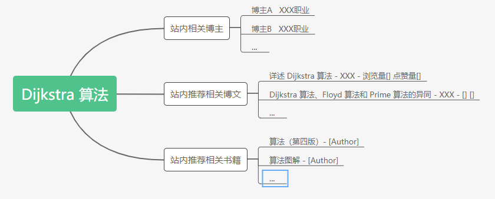
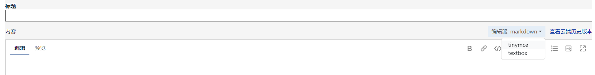
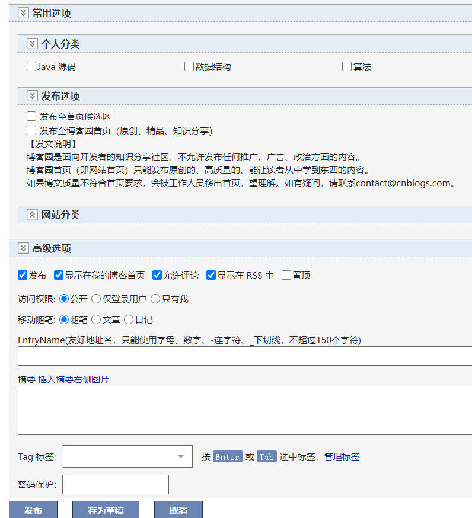
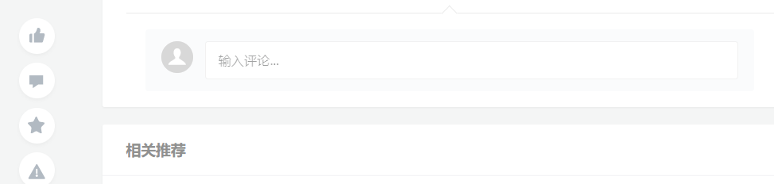
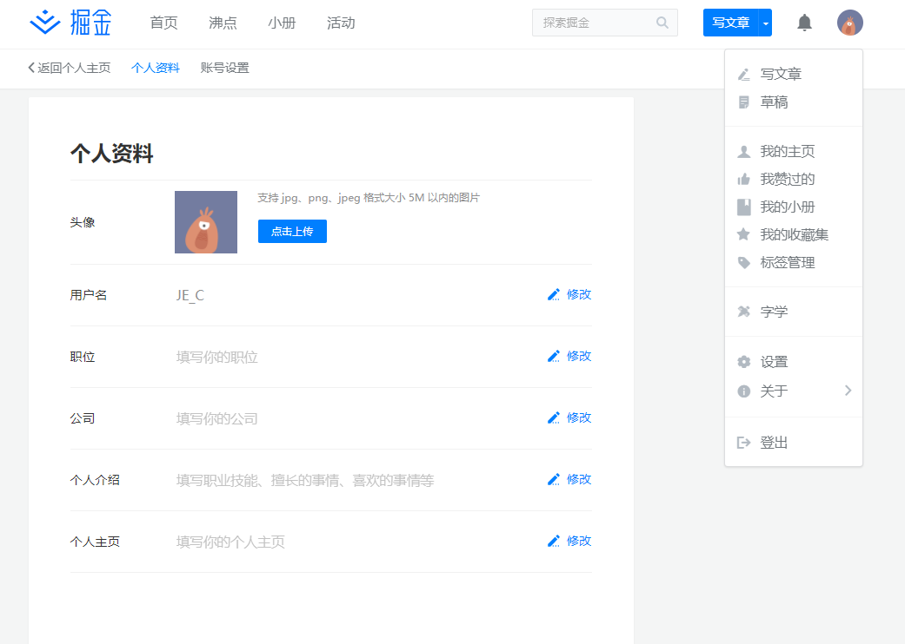
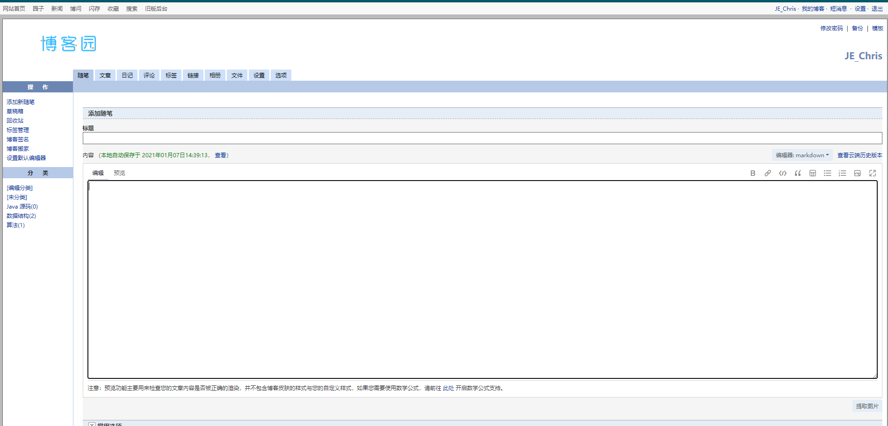
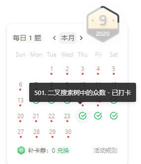
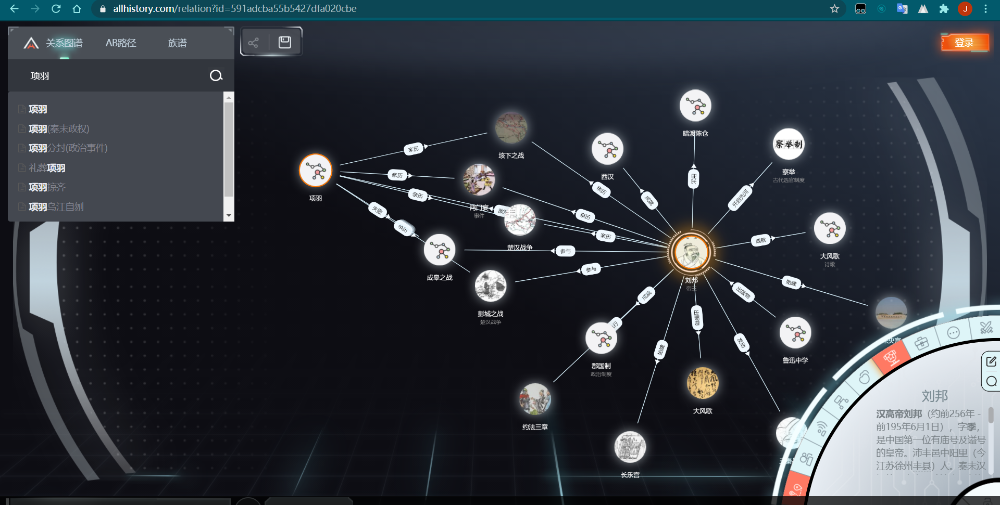

个人博客系统详解：

[TOC]

## 博客网站用户

1、 普通游客：

​	支持浏览博文，经过浏览可以增加

2、 注册用户：

​	相关功能：评论、个人信息、个人博客的增删改查；

​	写博客时，在标题下方可以直接写入本博文的相关Tag，可以被用于索引，尝试支持包括 Markdown 和 普通文本 两种兼容，也提供两种文本编写模式；

3、网站管理员【不确定是否需要实现】

​	负责网站内容绿色、和谐，对敏感词汇进行 `*` 号替代，对不当言论进行限制浏览、删帖等操作；一般不会执行功能；

## 博客网站功能

### 1、普通游客：【不保留用户信息，但是不提供用户功能】

- 浏览功能，在页面停留指定时间或者阅读到某个进度条的时候能增加博客的阅读量，具体再定；
- 查找功能，通过搜索框能做相关的 `博文`、`博主`、`话题`、`Tag`、`知识点` 进行搜索和模糊查询；

### 2、注册用户：【在网站进行专门注册的用户】

> 普通游客功能；
>
> 自定义注册博客地址；
>
> 写博客，支持 普通文本编写 和 Markdown 解析，支持文章Tag，相关书籍、博文介绍栏；
>
> 支持将博客导出，作为 Markdown 文件或者其他的；
>
> 同时支持删改查，删不直接删除文章，需要到回收站点击彻底删除才行；
>
> 修改用户信息，包括注册手机号、邮箱、网站自定义地址等等；
>
> 支持注销账户；
>
> 可以评论、回复相关信息、点赞、收藏相关博客，**尝试支持站内聊天框聊天** [至少能提供联系方式，提供私下联系方式]；

- 注册博客地址：类似于博客园，注册用户专用的跳转链接，所有相关的博文都在此下；【参照 [博客园](cnblogs.com)】

- 写博客 【参照 [博客园](cnblogs.com)】

- 评论、回复、点赞等操作 【参照 [掘金](juejin.cn)】

## 网站页面设计

### 1、主页设计

> 这个页面上中下分为 header, body, footer;
>
> header 为导航栏，body 为页面主题，footer 放网站备案号

> body 左右分为 最近发表博文区和推荐博文区
>
> 最近发表，根据网站博主上发博客的时间和用户刷新时间相关；每页显示有限条博文简介，分页查看；
>
> 推荐博文：根据浏览量和点赞量分别进行相关推荐；使用两个框体，上面的框推荐点赞榜，下面的推荐浏览榜；

### 2、用户页面设计

参照 [掘金](https://juejin.cn/user/settings/profile) 的页面设计，使用响应式布局，并且不会对页面进行平铺父窗口，会在两边留白；

在主页导航栏会有 登录和注册 的栏，如果登录了就会变为用户名称的一个下拉框，执行相关的操作，如查看博客、修改用户信息、退出登录，等等；

### 写博客页面

参照 [博客园](https://i.cnblogs.com/posts/edit) 的模样，会改一些显示方式；

### 其他页面

在不考虑关系图谱的页面的情况下，主要就是以上三个页面，会用 Vue 将相关的 页面进行串联，使用模板、组件进行穿插；

会将登录页和注册页单独用一个页面展示，而不是用弹窗[iframe]，一是它的性能较差，且信息传递有很大的问题，跨域之类的问题，我对前端的这些知识点了解的不是很清楚。

还有例如其他的信息修改页、博客总览页、博客管理页 会使用 Vue 进行拼接；

会尝试做出 leetcode 官网的博文发布、参与讨论等的日历展示；

## 进阶功能：关系图谱功能

> ​	因为这个功能我觉得会挺好，对于像博客这种偏碎片化、专向化的信息载体，只了解片面的知识对于一些求知者来说会显得片面，通过这个关系图谱的功能，查询者可以通过相关的博文找到更完善的知识体系、书籍，或者其他同类型的文章，从而深化、广化搜索的结果。
>
> > 例如：我搜索 Dijkstra 算法，可能出现一些博主，以及一些 Tag 为 Dijkstra 算法的博文，通过博文内容的一些参考资料啥的，将其一起展示出来；
> >
> > 
>
> ​	作为基础功能之外的功能，可以在此页面通过键入 `博主链接、博主名称、博文名称、相关 Tag、专业名称` 等在网页中动态绘制相关的关系网络，并且可以递归点击；用于快速搜索相关的专业内容、获取学习路径等；

类似效果图：

